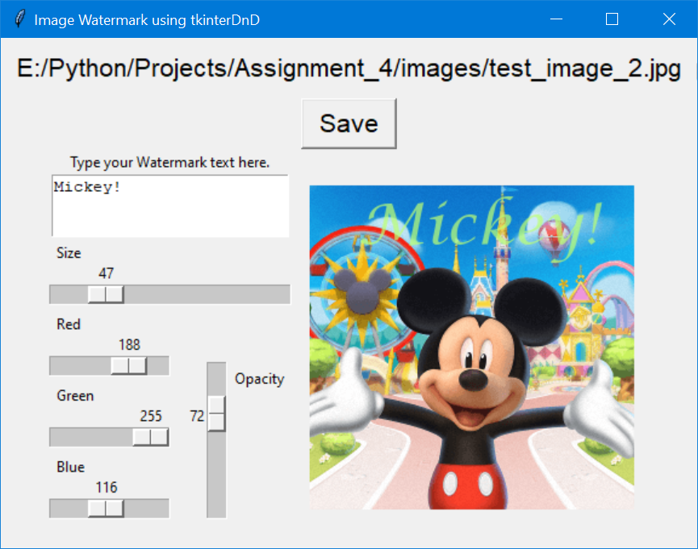

# Image Watermarking Desktop App

This program allows you to create a custom watermark on an image.

You simply drag and drop an image file onto the canvas, type in your watermark text, and adjust a few sliders. 

Then simply click Save to save the image to a new filename.

Enjoy!

